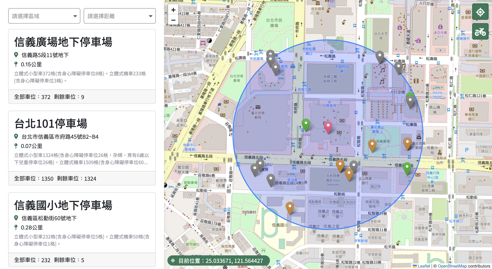

**使用[臺北市停車場資訊](https://data.gov.tw/dataset/128435)串接地圖，提供使用者一個能快速查找停車位的網頁平台。**

---

## 🗺 目前的功能有：

- 分區查詢功能
- 顯示附近停車位
- 顯示停車位詳細資料(e.g: 剩餘停車位、停車費費用…etc)
- 定位功能
- 停車位marker分類
- 分頁切換 - 顯示車位 / 機車位資訊

---

## 📍 部署位置

[哪裡有停車位](https://ga686.github.io/find-parking-lot/#/car)

---

## 🧑‍💻 開發環境

React

bootstrap

leaflet

react leaflet

styled-components

react-router-dom

sweetalert2

axios

redux

redux-thunk

---

## 👉 ****Get Started****

### **node版本為 v16.17.1**

**1. 打開終端機**

`cd 到你想電腦儲存的位置`

**2. 將專案下載下來**

`git clone https://github.com/ga686/find-parking-lot.git` 

**3. cd 到資料夾**

`cd find-parking-lot`

**4. 安裝 npm 相關套件**

`npm i`

**5. 本地端執行程式**

`npm start`

1. 打包

`npm run build`

1. 測試

`npm test`